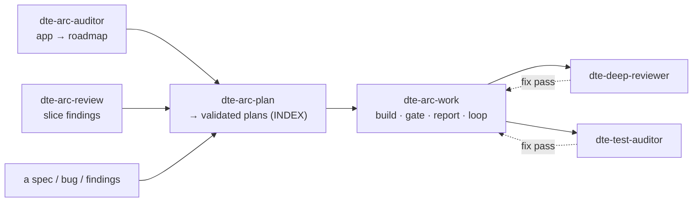

# dte-skills

**A [Claude Code](https://docs.claude.com/en/docs/claude-code) plugin of orchestration skills that
compose the AI-engineering tools you already have — intent-engineering, compound-engineering,
layered-rails, majestic, ponytail, cubic — into disciplined `review → plan → work → audit` flows for
Rails.**

The skills don't reinvent review or planning. They **conduct** the good tools you've installed, add the
discipline a one-off prompt forgets — *plan with a real planner, validate the plan, verify claims against
the code, gate every change, report every step, loop over many* — and write the results to durable docs.

---

## Why

A bespoke "go refactor my app" prompt tends to: reinvent planning, critique itself in the same breath,
run dark (you keep asking *"how far are we?"*), and never re-check the claims it made. `dte-skills` fixes
that by making the discipline first-class:

- **Compose, don't reinvent** — every skill invokes `/ce-plan`, `/ie-validate-plan`, `/layered-rails`, etc.
- **Plan, then validate** — real work is planned with compound-engineering's `ce-plan` and **validated**
  with intent-engineering's `ie-validate-plan` before a line is written.
- **Verify, don't trust** — a plan's load-bearing claims ("X already does Y", "zero of Z") are checked
  against the code, not assumed.
- **Gate + report every step** — a runnable gate before every commit; a loud report and a pause after
  every phase. No dark loops.
- **Loop at scale** — a massive task decomposes into many small, validated plans, completed one by one.
- **Degrade gracefully** — optional tools (Augment, cubic, MemPalace, mutant) are used if present and
  their absence is stated, never silently skipped.

---

## The skills

| Skill | Use it to… | Produces |
|---|---|---|
| **`/dte-arc-auditor`** | audit a whole app → a migration roadmap | target architecture + phased, validated, gated plan + `PROGRESS` worklist |
| **`/dte-arc-review`** | review a slice / structure (diagnostic) | severity-ranked architectural findings |
| **`/dte-deep-reviewer`** | review a PR / branch / diff | multi-lens, cross-model code findings |
| **`/dte-test-auditor`** | judge a test suite's real value | coverage + quality + mutation findings |
| **`/dte-arc-plan`** | turn findings / a spec / a bug into plan(s) | `ce-plan`-built, `ie-validate-plan`-validated plans (decomposes big work into many) |
| **`/dte-arc-work`** | do the work, gated and looped | branches + gate-green diffs + per-phase reports |
| **`/dte-tooling-scan`** | find what tooling to adopt next | overlap-aware adoption shortlist |
| **`/dte-loop`** | set up an autonomous gated loop over a batch | worklist doc + the exact command to trigger it (questions front-loaded) |
| **`/dte-spec`** | turn a fuzzy idea into a validated PRD | spec doc (What/Why/How, acceptance criteria) → feeds `dte-arc-plan` |
| **`/dte-ux`** | review **and** produce front-end (UI/UX) | UX findings (states, a11y, look-and-feel) and/or built UI |
| **`/dte-feature`** | build a full-stack feature, both layers solid | back-end + front-end planned, built, and **both** verified |
| **`/dte-perf`** | find the real bottleneck, measured | baseline numbers + ranked, evidence-backed fixes |
| **`/dte-security-sweep`** | security posture / PR review | traced, severity-ranked vulns + scanner results |
| **`/dte-debug`** | track a bug to root cause, fix once | runnable repro (before/after) + shared-path fix + regression test |
| **`/dte-migrate`** | safe upgrade or schema/data migration | small reversible gated steps + rollback path |

### How they fit together



**Greenfield from an idea:** `dte-spec` → `dte-arc-plan` → `dte-feature` (or `dte-arc-work`).
**Re-architect an existing app:** `dte-arc-auditor` → `dte-arc-work`.
**Check a PR / a slice / the tests:** `dte-deep-reviewer` / `dte-arc-review` / `dte-test-auditor`.
**Specialist passes:** `dte-ux` (front-end) · `dte-perf` (speed) · `dte-security-sweep` (vulns) · `dte-debug` (bugs) · `dte-migrate` (upgrades).
**Run a batch autonomously:** `dte-loop` builds the worklist + hands you one command; each item runs on its own branch, gated.

→ **[Visual guide & flow walkthrough](https://davidteren.github.io/dte-skills/)** ·
→ **[What each skill needs (dependency matrix)](DEPENDENCIES.md)**

---

## Install

```bash
claude plugin marketplace add davidteren/dte-skills
claude plugin install dte-skills@dte-skills-marketplace
# restart Claude Code to load the skills
```

`dte-skills` is an **orchestrator** — it's only as strong as the tools it composes. For full
functionality install these too (see [DEPENDENCIES.md](DEPENDENCIES.md) for the per-skill breakdown):

| Tier | Plugin | Gives |
|---|---|---|
| **Required** | [`compound-engineering`](https://github.com/EveryInc/compound-engineering-plugin) | `ce-plan`, `ce-work`, `ce-code-review` (cross-model) |
| **Required** | [`intent-engineering`](https://github.com/davidteren/intent-engineering) | `ie-validate-plan`, `ie-review`, `ie-audit` |
| **Required (Rails)** | [`layered-rails`](https://github.com/palkan/skills) | architecture analysis (callbacks / gods / services) |
| **Recommended** | `majestic-rails`, `rails-testing-v8`, `ponytail` | Rails reviewers/coders · Minitest depth · the elegance pass |
| **Optional** | Augment, cubic, MemPalace, a mutation tester | richer context · team patterns · history · mutation signal |

Skills degrade gracefully when an optional tool is missing — and say so in their output.

---

## Usage

```text
# review a slice
/dte-arc-review app/billing

# spec → validated plans → build it
/dte-arc-plan docs/feature-spec.md          # → docs/plans/INDEX-*.md
/dte-arc-work docs/plans/INDEX-feature.md   # builds each plan, gated, pausing after each

# audit an app and get a migration roadmap
/dte-arc-auditor app/services

# judge a test suite
/dte-test-auditor test/models
```

Every looping skill **pauses after each phase** by default. Pass `--ship` to `dte-arc-work` to auto
commit/PR, `--serial` to slow a loop down, `--quick`/`--deep` to size the cycle.

---

## Conventions it follows

Read [`references/conventions.md`](references/conventions.md) — the shared rules every skill obeys
(plan-then-validate, decomposition, verify-claims, runnable-gate, report-every-phase, surface-forks-early,
honor the project's own `CLAUDE.md`).

## Project status & contributing

Shipped state + roadmap: **[STATUS.md](STATUS.md)**. Where the suite is still thin + the decisions taken:
**[GAPS.md](GAPS.md)**. Building or editing a skill? Read
**[AGENTS.md](AGENTS.md)** first — it carries the design rules and the hard-won lessons that keep the
skills solid (why dark loops, self-critique, and unverified claims are banned).

## License

MIT — see [LICENSE](LICENSE).
